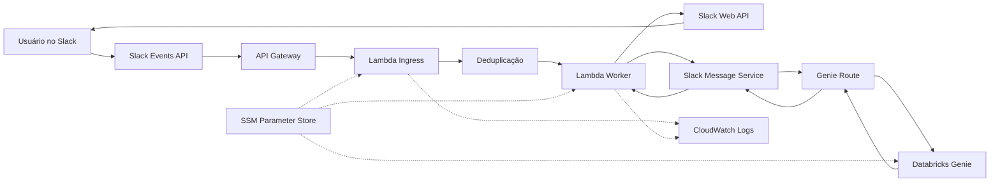

## Arquitetura 

### 1) Lambda Ingress (`main.handler`)
- Recebe o evento HTTP do Slack.
- Valida assinatura (`x-slack-signature`).
- Faz ACK rápido para o Slack.
- Ignora retries com `http_timeout` para reduzir duplicidade.
- Encaminha `app_mention` de forma assíncrona para o worker via `Invoke` de Lambda (`InvocationType="Event"`).

### 2) Lambda Worker (`worker.handler`)
- Recebe o payload já validado.
- Processa a pergunta com Genie/Databricks.
- Envia mensagens no Slack (mensagem inicial + resposta + SQL de debug opcional).

## Variáveis de ambiente importantes

- `SLACK_BOT_TOKEN`
- `SLACK_SIGNING_SECRET`
- `SLACK_WORKER_LAMBDA_NAME` (nome da Lambda worker chamada pelo ingress)
- `SLACK_SKIP_HTTP_TIMEOUT_RETRIES` (default `true`)
- `app_env` (`dev`, `prod`, usado no prefixo SSM)
